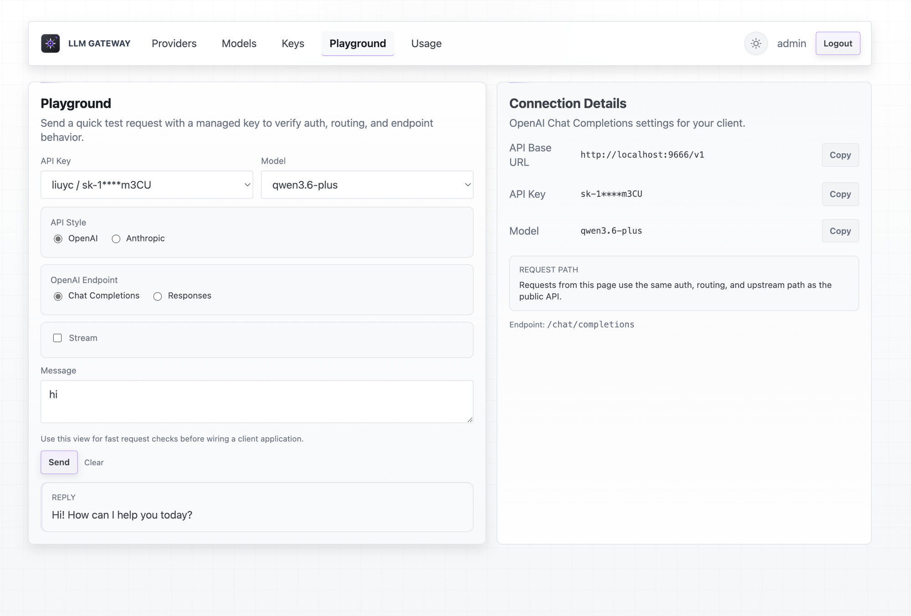
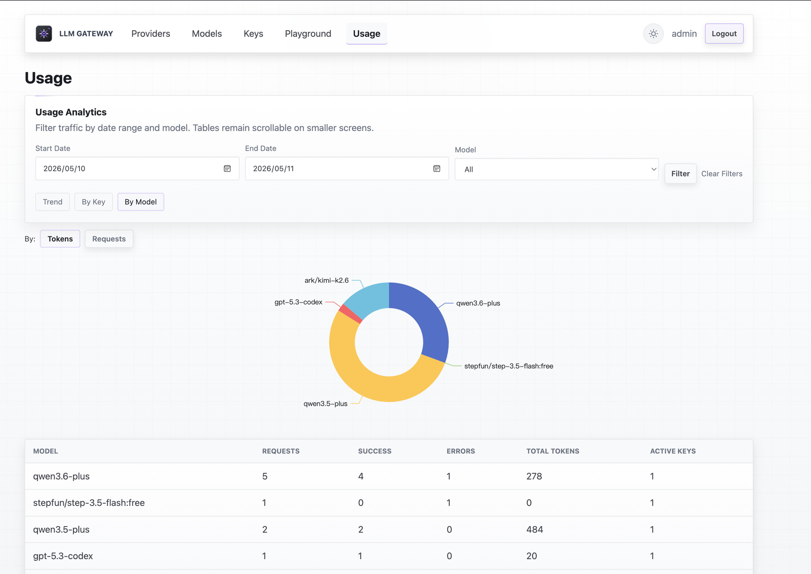
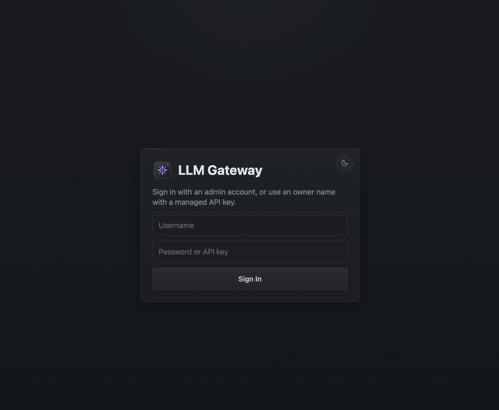
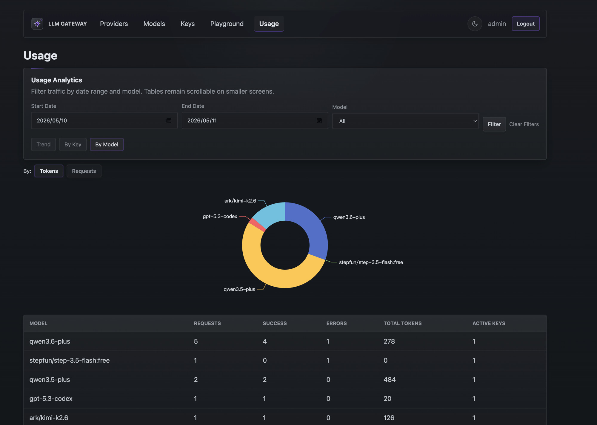

# aigate

Minimal Go gateway for OpenAI-like LLM APIs.

## Features

- OpenAI-compatible `POST /v1/chat/completions` (non-stream + `stream=true`)
- Anthropic-compatible `POST /anthropic/v1/messages` (non-stream + `stream=true`)
- OpenAI Responses API `POST /v1/responses` (non-stream + `stream=true`)
- `POST /v1/embeddings`, `GET /v1/models`
- Configurable model-to-provider mapping
- Client API key authentication
- SQLite-backed usage analytics with trend charts
- Web admin UI with dark/light theme

## Screenshots

### Light Theme

**Playground** — test requests with managed keys, switch between OpenAI/Anthropic styles:

<a href="./docs/screenshots/playground-light.jpeg"></a>

**Usage**

<a href="./docs/screenshots/usage-light.jpeg"></a>

### Dark Theme

**Login**

<a href="./docs/screenshots/login-dark.jpeg"></a>

**Usage Analytics:**
<a href="./docs/screenshots/usage-dark.jpeg"></a>

## Quick Start

1. Prepare config.

```bash
cp .env.example .env
```

2. Start the server.

```bash
go run ./cmd/aigate -config config.example.json
```

3. Open the admin.

```text
http://localhost:8080/admin/login
```

Default credentials:

```text
username: admin
password: admin123
```

4. Add a provider, model, and key in the admin UI:

- **Provider**: `name`, `base_url`, `api_key` or `api_key_ref`, `timeout`
- **Model**: `public_name`, `provider`, `upstream_name`
- **Key**: `key`, `name`, `owner` (optional), `purpose`

Use either:
- `api_key`: the real upstream secret
- `api_key_ref`: an environment variable name such as `OPENAI_API_KEY`

5. Call the gateway.

```bash
curl http://localhost:8080/v1/chat/completions \
  -H 'Authorization: Bearer sk-app-001' \
  -H 'Content-Type: application/json' \
  -d '{
    "model": "gpt-4o-mini",
    "messages": [{"role": "user", "content": "hello"}]
  }'
```

Stream mode:

```bash
curl http://localhost:8080/v1/chat/completions \
  -H 'Authorization: Bearer sk-app-001' \
  -H 'Content-Type: application/json' \
  -d '{
    "model": "gpt-4o-mini",
    "stream": true,
    "messages": [{"role": "user", "content": "hello"}]
  }'
```

Embeddings:

```bash
curl http://localhost:8080/v1/embeddings \
  -H 'Authorization: Bearer sk-app-001' \
  -H 'Content-Type: application/json' \
  -d '{"model": "text-embedding-3-small", "input": "hello"}'
```

Read usage:

```bash
curl http://localhost:8080/v1/usage -H 'Authorization: Bearer sk-app-001'
```

## Config

JSON config. Example: [config.example.json](./config.example.json)

The server loads `.env` if present; process environment variables take precedence.

- `auth.keys`: supports plain string or object with `key`, `name`, `owner`, `purpose`
- `admin.username` / `admin.password`: admin login credentials
- `storage.sqlite_path`: SQLite database path
- `storage.flush_interval`: seconds between usage flushes
- `providers[]`: `api_key` (inline secret) or `api_key_ref` (env var name)

## Test

```bash
GOCACHE=/tmp/go-build GOMODCACHE=/tmp/go-mod-cache go test ./...
```
